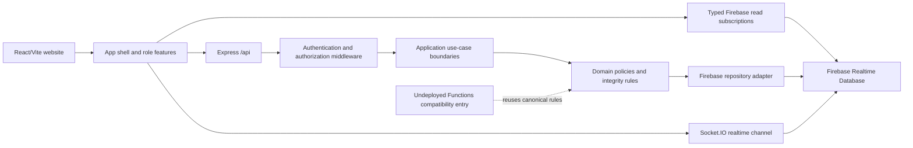

# TapTap Foodtrip Architecture

## Direction

TapTap Foodtrip is a modular monolith. It uses one React website, one canonical Express API,
and one Firebase Realtime Database. The system does not use microservices.



Sensitive writes flow through Express. Firebase browser subscriptions provide realtime reads.
Realtime Database is authoritative for operational data.

## Client Responsibilities

| Area | Location | Responsibility |
| --- | --- | --- |
| App shell | `client/src/App.jsx` | Authentication gates, lazy feature composition, and global status UI |
| Cross-cutting hooks | `client/src/hooks/useAppState.js` | Auth/profile, role navigation, notifications, and cart/checkout state |
| Role features | `client/src/features/` | Customer, owner, staff, rider, and authentication screens |
| Shared UI | `client/src/components/` | Branding, loaders, maps, charts, photos, and camera proof |
| Typed contracts | `client/src/types/` and `client/src/contracts/` | Domain types, constants, API records, and runtime guards |
| API adapter | `client/src/services/api.ts` | Authenticated HTTP requests and response-object validation |
| Firebase facades | `client/src/services/firebase/` | Domain-specific import boundaries and subscription APIs |
| Compatibility adapter | `client/src/services/firebase.js` | Existing implementation retained during gradual migration |

All feature code imports a domain Firebase facade instead of importing the compatibility
adapter directly. Firebase and API payloads are filtered through runtime guards before feature
screens receive them. Subscriptions return cleanup functions and are removed by React effects.

## Server Responsibilities

| Area | Location | Responsibility |
| --- | --- | --- |
| Startup | `server/src/index.js` | Dependency composition, HTTP startup, signals, and graceful shutdown |
| HTTP transport | `server/src/app.js` and `server/src/routes/` | Express configuration, route mapping, health endpoints, and response contracts |
| Socket transport | `server/src/sockets/` and `server/src/realtime/` | Authenticated rooms, rider updates, and server-side event publishing |
| Configuration | `server/src/config/` and `server/src/integrations/firebaseAdmin.js` | Validated environment configuration and isolated Admin SDK bootstrap |
| Middleware | `server/src/middleware/` | Request IDs, rate limits, revoked-token authentication, role checks, runtime validation, and centralized errors |
| Observability | `server/src/observability/` | Structured JSON event logging without customer payloads or secrets |
| Application boundaries | `server/src/application/` | Stable use cases grouped by orders, catalog, feedback, delivery, and workforce; delivery GPS/proof now lives here |
| Domain | `server/src/domain/` | Order transitions, authorization policies, idempotency, aggregates, and 2FA policy |
| Repository | `server/src/repositories/firebaseRepository.js` | Firebase read, update, and transaction operations |
| Compatibility core | `server/src/business.js` | Existing use-case implementations retained while extraction proceeds incrementally |
| Optional adapters | `server/src/services.js` and related modules | Email and deferred provider integrations with disabled fallbacks |

`server/src/business.js` remains a tested compatibility core for use cases not yet extracted.
Delivery GPS and proof persistence are the first completed extraction and are covered by focused
application tests. New policy logic belongs in `server/src/domain/`; new data access should use the
repository adapter. Move one domain at a time and remove the old implementation instead of duplicating it.

## Canonical Backend

Express is the authoritative implementation for:

- order creation and idempotency
- status transitions and cancellation
- price recalculation and stock transactions
- rider claims and assignment
- delivery proof persistence
- inventory and payment movement records
- review moderation and public review projection
- shifts, approvals, notifications, audit logs, and reporting aggregates

`functions/` is optional and undeployed. Its policy exports point to the canonical server
modules so a second implementation cannot drift. Because those imports cross the Functions
package boundary, do not deploy it as-is. A future paid deployment must first package the shared
core explicitly and rerun the complete test suite.

## Data Integrity

The backend applies these invariants:

- Clients send item IDs and quantities; the server reloads prices and recalculates totals.
- Order creation keys prevent accidental duplicate submissions for seven days. The server binds
  each key to a request fingerprint, so reusing a key for different order data is rejected.
- Stock deduction, cancellation restoration, and rider claims use Firebase transactions. Cancellation
  recovery uses a transaction-owned marker so a retry can finish history and aggregate writes without
  returning stock twice.
- Role-specific order queries use indexed customer, rider, status, and archive fields instead of
  loading unrelated role data. API callers can opt into bounded cursor pagination without breaking the
  legacy unpaginated response. Unassigned rider jobs come from a private-data-safe projection.
- Audit logs, daily report aggregates, complaints, reviews, notifications, and shift logs have a
  read-only `/api/history/:collection` cursor boundary. Opaque cursors preserve stable ordering, and
  customer/staff pages are scoped before records are returned.
- Browser listeners retain realtime behavior for active operations but bound customer/rider orders,
  notifications, reviews, audit logs, shift logs, complaints, public reviews, and support messages.
  Older records are available through cursor pages instead of permanent complete-collection listeners.
- Inventory and payment movements are append-only server records.
- Daily sales aggregates use Asia/Manila date keys and server increment operations.
- Available rider jobs use a sanitized projection without customer address or private details.
- Public reviews contain approved display fields only.
- Notifications and compressed proof records include retention timestamps.

## Firebase Access

Realtime Database rules enforce customer isolation, review ownership, protected profile fields,
role scopes, notification privacy, rider assignment access, and server-only operational writes.
`storage.rules` denies every Storage operation because Storage is disabled in the free-first
configuration. Delivery proof fallback data is compressed, validated, size-limited, and written
through Express to Realtime Database.

Rule behavior is tested in `test/database.rules.test.mjs` against the Realtime Database emulator.

## Analytics Boundary

Website conversion events pass through the typed `client/src/services/analytics.ts` boundary.
It accepts product, role, source, quantity, value, currency, and coded funnel facts only. Customer
identity, contact details, addresses, delivery coordinates, notes, OTPs, messages, and proof data
must never be sent to Analytics. Event definitions, funnel setup, and reporting limitations are in
`docs/ANALYTICS.md`.

## Browser Messaging And PWA Boundary

One production service worker at `/service-worker.js` handles both Firebase Cloud Messaging and the
optional PWA shell. Notification permission is requested only from the notification-center action.
FCM tokens are hashed for their database keys, stored under private server-only paths, scoped to the
authenticated user, and removed when disabled or rejected by Firebase.

The worker caches versioned same-origin static assets, the manifest, branding, and the offline page.
Navigations remain network-only with an offline fallback. API responses, checkout/payment routes,
delivery proofs, notifications, and role data are excluded from caching. Each build gets a new cache
name and activation removes prior TapTap static caches.

## Performance Boundary

Firebase Performance Monitoring is a production-only, explicit opt-in loaded during browser idle
time. Custom traces are limited to menu loading, checkout submission, and initial dashboard display.
Attributes contain role and outcome codes only. Monitoring failures are swallowed at the boundary so
they cannot change ordering or dashboard behavior.

## Environment Modes

### Client

| Variable | Purpose |
| --- | --- |
| `VITE_ENABLE_DEMO_MODE` | Must be exactly `true` to allow local demo accounts |
| `VITE_DISABLE_FIREBASE` | Disables browser Firebase initialization for deterministic tests |
| `VITE_ENABLE_FIREBASE_STORAGE` | Keep `false` in the free-first setup |
| `VITE_USE_FIREBASE_EMULATORS` | Connects browser SDKs to local emulators in development |
| `VITE_API_BASE_URL` | Express API base URL |
| `VITE_SOCKET_URL` | Socket.IO server URL |
| `VITE_FIREBASE_*` | Public Firebase web application configuration |
| `VITE_FIREBASE_VAPID_KEY` | Public Firebase Web Push certificate key |
| `VITE_FIREBASE_MEASUREMENT_ID` | Public Firebase Analytics measurement ID |
| `VITE_ENABLE_ANALYTICS` | Explicit production Analytics opt-in |
| `VITE_ENABLE_PERFORMANCE_MONITORING` | Explicit production Performance Monitoring opt-in |
| `VITE_ENABLE_PWA` | Registers the shared production PWA/FCM worker unless exactly `false` |
| `VITE_STORE_*` | Website store name, address, and delivery pin |

### Server

| Variable | Purpose |
| --- | --- |
| `PORT`, `CLIENT_ORIGIN` | Local HTTP port and allowed website origin |
| `TRUST_PROXY`, `SHUTDOWN_TIMEOUT_MS` | Known proxy hop count and graceful shutdown deadline |
| `FIREBASE_DATABASE_URL` | Admin SDK Realtime Database target |
| `GOOGLE_APPLICATION_CREDENTIALS` | Ignored local service-account path or use application-default credentials |
| `TWO_FACTOR_ENCRYPTION_KEY` | Server-only TOTP secret encryption key |
| `GMAIL_USER`, `GMAIL_APP_PASSWORD` | Optional email OTP and receipt delivery |
| `TURNSTILE_SECRET_KEY` | Optional server-side registration bot protection |
| `ENABLE_OPENAI`, `ENABLE_TWILIO`, `ENABLE_PAYMONGO` | Explicit provider opt-ins; keep `false` while deferred |

Never put server secrets in `client/.env` or commit any `.env` file.

## Backend Operations

- `GET /health/live` confirms that the Node process can serve HTTP.
- `GET /health/ready` returns success only when Firebase Admin is ready.
- Every response includes `X-Request-ID`; a valid caller-supplied ID is preserved for tracing.
- API failures use a centralized JSON error shape. Raw Firebase initialization failures are not public.
- Structured logs redact credentials, contact details, addresses, delivery locations, proof data, OTPs,
  and signatures. Unexpected HTTP and Socket.IO failures return generic public errors with traceable codes.
- Firebase ID tokens are checked for revocation on API and Socket.IO authentication.
- Owner role changes preserve unrelated claims, revoke refresh tokens, and prevent demoting the final owner.
- Owner account suspension disables Firebase Authentication access, revokes refresh tokens, records an
  audit event, prevents suspension of the final owner, and is available from the owner user dashboard.
- Order creation accepts `Idempotency-Key`; identical retries replay the original result without a second
  stock deduction, while a different payload with the same key returns a conflict.
- Owner recovery endpoints first return a read-only bounded scan, then require a reason, a dry-run hash,
  an explicit confirmation value, and a unique request ID. Executable repairs resume incomplete
  cancellations, synchronize public stock from authoritative inventory, or release expired processing
  claims without deleting fingerprints. Every completed repair writes a deterministic audit event.
- Aggregate gaps, malformed order quantities, failed notifications, unresolved COD, and missing proofs
  are review-only findings. The server does not invent payments, proof, stock history, or delivery facts.
- The owner-only operational metrics endpoint reports process-lifetime request, latency, checkout,
  stock-conflict, authorization, readiness, socket, cancellation, and COD aggregates without customer data.
- Customer reorders are rebuilt from the current menu and report skipped or stock-reduced items. Staff POS
  supports keyboard product search and unique-result entry. Rider queues prioritize active delivery states and
  preserve failed actions for manual retry after reconnection. Owner settings expose the audited recovery flow.
- The production container runs as the unprivileged Node user and checks `/health/live`.

### Demo Versus Production

`client/.env.e2e` explicitly enables demo mode, disables Firebase, and contains no secrets.
Development may use demo mode for local role walkthroughs. Production must set
`VITE_ENABLE_DEMO_MODE=false`, configure Firebase Authentication, remove demo passwords, and use
real role claims. An absent Firebase configuration does not silently enable demo credentials.

## Deferred Integrations

OpenAI, Twilio, and PayMongo are outside the current architecture update. Their optional code is
retained, but credentials alone cannot enable them. Each provider also requires its explicit
`ENABLE_*` flag. Tests clear their credentials and assert that no related network request occurs.
The supported demonstration path uses deterministic assistant fallbacks, in-website
notifications, TOTP or email verification, and COD/manual payment.

Do not configure provider keys, add webhooks, or enable these integrations until a separate
review covers provider security, signatures, privacy, failure handling, and cost.

## Local Setup

1. Install Node.js 22 and Java 21.
2. Run `npm install`, `npm install --prefix client`, and `npm install --prefix server`.
3. Copy the client and server `.env.example` files to ignored `.env` files.
4. For a Firebase-backed session, enable Email/Password Auth and provide local Admin credentials.
5. Run `npm run dev`.
6. Open `http://localhost:5173`.

## Validation

```powershell
npm run typecheck --prefix client
npm run lint --prefix client
npm run build --prefix client
npm run performance:check --prefix client
npm run test --prefix server
npm run smoke:preview --prefix client
npm run test:rules
npm run test:e2e
npm run check:cycles
npm run check:operations-docs
npm run audit:production
```

`npm run test:rules` starts the Database emulator and requires Java. Playwright starts isolated
demo servers on ports 4173 and 8181. It covers the landing and registration flow, COD checkout,
owner reports, staff POS/order queue, rider delivery/proof workflow, console errors,
accessibility, touch targets, and responsive layouts at 320x700, 375x812, 430x932, 768x1024,
812x375, and desktop widths.

`npm run validate:release` runs every required release gate in order. Both deployment commands invoke
it first, so a failed typecheck, lint, cycle scan, operations-document check, production dependency audit,
build, bundle budget, preview smoke, server test, Rules test, or Playwright test prevents Firebase deployment.
The GitHub validation workflow runs the same gates with Node.js 22 and Java 21 on every push and pull request.

## Free-Service Boundary

Local development and demonstration can run without paid integrations. Firebase Spark quotas
and terms still apply, and a public production website is not guaranteed to remain free.
The default `npm run deploy` builds the client and deploys Database rules only. Storage,
Functions, Cloud Run, and App Hosting remain disabled or undeployed.

A public deployment needs an HTTPS host for the website and a reachable HTTPS Express/Socket.IO
backend. Hosting that backend may incur cost. Future Firebase Functions, Cloud Run, Storage,
OpenAI, Twilio, or PayMongo use must be treated as a separate paid deployment decision.
